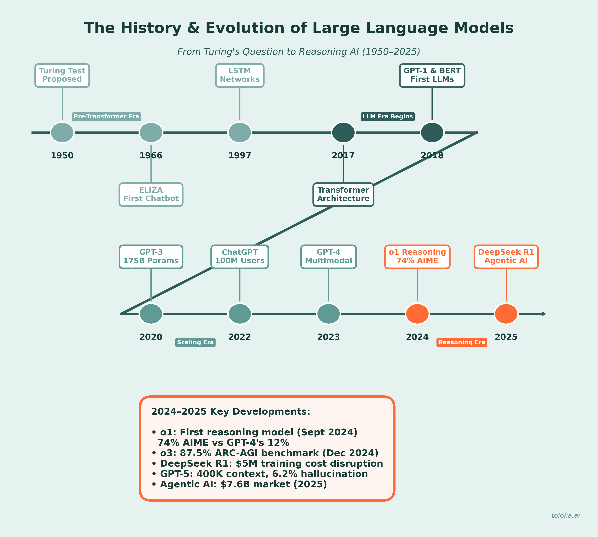

## The Software Engineer Reborn

- A vision of human–AI collaboration.

::: {.notes}

The talk is an exploration of what’s happening to me, the role, and the world.
I’ve tried to anchor it in my experience but I couldn’t help pontificate a little.
Hopefully it is helpful regardless of what stage you are in your career as a software engineer, you learn some tricks about using AI, and it provokes some thought about the interaction of AI with society.

I'm optimistic.
I have generally worked on the strategy of somewhat liking my work, and with some flexability there will always be work for people who are willing to work hard.
I don’t want it to be doom and gloom.
But don’t want to make light of the uncertainty, or to suggest that cause for fear and anxiety are not warranted.
There is lots happening right now… and I will note that death is a pre-requisite  of rebirth.

:::


## LLMs timeline

{.timeline-figure .nostretch fig-alt="Timeline of large language model development, from the Turing Test in 1950 through developments in 2025."}

::: {.image-credit}

Image: [Toloka — History of LLMs](https://toloka.ai/blog/history-of-llms/).

:::


## My career... {.personal-timeline}

::: {.milestones}

::: {.milestone}

[2015]{.milestone-date}

**Neuroscience PhD**

Then data science & DevOps at NIMH, NIH-IRP

2015–2020

:::

::: {.milestone}

[2020]{.milestone-date}

**Quansight**

Software engineer at a global open-source consultancy

2020–2023

:::

::: {.milestone}

[2023]{.milestone-date}

**Python AI Solutions**

My own consultancy

2023–2026

:::

::: {.milestone}

[2026]{.milestone-date}

**Dartmouth College**

Research software engineer, Center for Open Neuroscience

:::

::: {.milestone .future}

[2027]{.milestone-date}

**What's a software engineer?**

:::

:::

::: {.llm-landmarks}

**LLM landmarks** · 2017 Transformers → 2022 ChatGPT → 2023 GPT-4 → 2024 Reasoning

:::

::: {.notes}

The expansion of capability is why I take this seriously.
LLM landmarks follow the adjacent [Toloka timeline](https://toloka.ai/blog/history-of-llms/).

:::

## Obsession with AI... my highlights {.personal-timeline}

::: {.milestones}

::: {.milestone}

[2018]{.milestone-date}

**AI in my research**

Auto-encoder based brain detection

[pbrain](https://github.com/leej3/pbrain)

:::

::: {.milestone}

[2022]{.milestone-date}

**The ChatGPT moment**

**November** ChatGPT interface to gpt 3.5 released

:::

::: {.milestone}

[2023]{.milestone-date}

**Made it my business**

**July** Founded Python AI Solutions

:::

::: {.milestone}

[2024]{.milestone-date}

**AI proves itself to me**

**Feb** · Company manifesto & website

**Jun** · Sonnet 3.5

**Sep** · Wife tries to ban my obsessive chatter about AI

:::

::: {.milestone}

[2025]{.milestone-date}

**More AI madness**

**February** Sonnet 3.7

**December** Start to wind down the business

:::

:::

::: {.llm-landmarks}

**LLM landmarks** · 2017 Transformers → 2022 ChatGPT → 2023 GPT-4 → 2024 Reasoning

:::

::: {.notes}

The expansion of capability is why I take this seriously.
LLM landmarks follow the adjacent [Toloka timeline](https://toloka.ai/blog/history-of-llms/).

:::

## Capabilities, discovery and access {.smaller}

As of 8 September 2026; Navier–Stokes updated 9 September.

- **ARC-AGI-3:** Astra scores 62.7% with the Standard harness and 99.9% with its Provider Adapter.
  Harness and compute materially change results.
  [Source](https://arcprize.org/results/openai-gpt-6-astra)
- **Verified mathematics:** Claude formalized Fermat’s Last Theorem in Lean in 11 days, according to Anthropic: an existing theorem, now machine-checked.
  [Source](https://www.anthropic.com/research/formalizing-fermats-last-theorem)
- **New mathematics:** OpenAI has published its proposed Navier–Stokes proof: smooth forcing can produce finite-time breakdown.
  [Paper](https://cdn.openai.com/pdf/32d9f210-8b73-45e0-91bc-82a30aef8a9a/navier-stokes.pdf) · [Lean proof](https://github.com/openai/NavierStokesAndEuler)
- **Open weights:** DeepSeek V4 Pro scores [36](https://artificialanalysis.ai/models/deepseek-v4-pro) against Sol’s [47](https://artificialanalysis.ai/models/gpt-5-6-sol) on Artificial Analysis’ Intelligence Index v4.3.
- **Local deployment:** [Phi-3-mini](https://www.microsoft.com/en-us/research/publication/phi-3-technical-report-a-highly-capable-language-model-locally-on-your-phone/) rivals GPT-3.5 on selected benchmarks on a phone.
  [14B Phi-4](https://huggingface.co/microsoft/phi-4) beats GPT-4o on selected math/science tests.
  Its 4-bit weights need roughly 7 GB plus runtime memory.


::: {.notes}

Snapshot: 8 September 2026.
Claims describe the cited evidence, rather than universal model equivalence.

Fermat’s Last Theorem: Anthropic announced the formalization on 4 September 2026.
The achievement translates existing mathematics into a complete Lean proof, building on human-written open-source infrastructure.
It illustrates a useful pattern for this talk: AI proposes a large artifact, while a separate formal checker verifies its logical steps.
Formal verification still depends on the theorem statement and foundational assumptions matching the intended claim.
[Research announcement](https://www.anthropic.com/research/formalizing-fermats-last-theorem) and [public Lean proof](https://github.com/anthropics/fermats-last-theorem).

Navier–Stokes update, checked 9 September 2026: the [paper](https://cdn.openai.com/pdf/32d9f210-8b73-45e0-91bc-82a30aef8a9a/navier-stokes.pdf) and [Lean formalization](https://github.com/openai/NavierStokesAndEuler) are public.
[OpenAI reports](https://openai.com/index/navier-stokes-solution/) that an initially resting fluid, under smooth forcing, develops unbounded velocity in finite time while its energy stays finite: alternatives C and D of the Millennium Prize formulation.
This is a proposed new result, unlike formalizing the already-known Fermat theorem.

The successful group used roughly 10,000 concurrent agents powered by an internal model more capable than Astra: 88 hours to the result, then 17 hours for Lean formalization and verification using Astra.
The Navier–Stokes effort involved 2.7 million messages and approximately 130 billion output tokens.
Human researchers redirected resources and used Codex to share insights between groups.
OpenAI also reports a separate unforced Euler result and says it will not claim the Millennium Prize.
Public proof artifacts enable scrutiny; publication is not the same as independent mathematical acceptance.

[1] ARC Prize: <https://arcprize.org/results/openai-gpt-6-astra> Best observed semi-private Standard harness score: 62.7% at max reasoning for $26,098. Provider Adapter: 99.9% at high reasoning for $18,817.
These are different configurations and compute budgets.
A benchmark score does not establish AGI.

[3] DeepSeek V4 Pro 0813: <https://artificialanalysis.ai/models/deepseek-v4-pro>

[4] GPT-5.6 Sol: <https://artificialanalysis.ai/models/gpt-5-6-sol> Current Intelligence Index v4.3 values, 36 and 47, respectively.
Index points are not percentages.
Open weights do not imply inexpensive consumer deployment: DeepSeek V4 Pro has 1.6T total parameters.

[5] Microsoft Phi-3 report: <https://www.microsoft.com/en-us/research/publication/phi-3-technical-report-a-highly-capable-language-model-locally-on-your-phone/> The demonstrated comparison is GPT-3.5, not original GPT-3.
Phone deployment and competitive selected benchmarks were already demonstrated in 2024.

[6] Phi-4 model card: <https://huggingface.co/microsoft/phi-4> 14B parameters.
Phi-4 vs GPT-4o: GPQA 56.1 vs 50.6, MATH 80.4 vs 74.6, but MMLU 84.8 vs 88.1, HumanEval 82.6 vs 90.6, SimpleQA 3.0 vs 39.4.
Selected benchmark parity is not full GPT-4/4o equivalence, particularly for factual recall or multimodality.

[7] Quantized distribution: <https://huggingface.co/microsoft/phi-4-gguf> *Weight-memory estimate: 14 billion parameters × 4 bits / 8 = 7 billion bytes (~6.5 GiB), before quantization metadata, KV cache and runtime overhead.
This is an engineering estimate, not a tested minimum.
A laptop/workstation with sufficient memory is the relevant deployment class.

:::

## AI improving the machinery of AI {.smaller}

Steps toward recursive self-improvement, as of 8 September 2026.

- **Algorithms and AI chips:** AlphaEvolve proposes and evaluates better algorithms.
  Google reports integrating its circuit improvements into next-generation TPUs.
  [Method](https://deepmind.google/blog/alphaevolve-a-gemini-powered-coding-agent-for-designing-advanced-algorithms/) and [deployment](https://deepmind.google/blog/alphaevolve-impact/).
- **AI-designed inference hardware:** OpenAI designed Jalapeño from scratch with Broadcom, using AI to accelerate design and optimization: nine months to tape-out.
  Reported benchmarks show better throughput per kilowatt and token latency than compared systems.
  [Development](https://investors.broadcom.com/news-releases/news-release-details/openai-and-broadcom-unveil-llm-optimized-intelligence-processor) and [results](https://openai.com/index/the-full-stack-behind-abundant-intelligence/)
- **AI research:** OpenAI reports 3.1 agent-workdays per human workday in its research organization.
  This is agent runtime, not a productivity multiplier.
  [Source](https://openai.com/index/research-acceleration-view-inside-openai/)
- **The potential feedback loop:** Better AI helps build better successors, which could accelerate the next round.
  The evidence above demonstrates parts of this loop; fully autonomous recursive improvement remains a stronger claim.
  [Research context](https://openai.com/index/research-acceleration-view-inside-openai/)

::: {.notes}

AlphaEvolve combines model-generated programs with automated evaluators and an evolutionary search process.
Its 2025 report includes improvements to AI training processes, including training the models underlying AlphaEvolve itself.
Google’s May 2026 update reports that it has become a regular tool for next-generation TPU design, with a suggested circuit integrated into silicon.
This is evidence of AI-assisted improvement to the infrastructure used for AI.
[Original report](https://deepmind.google/blog/alphaevolve-a-gemini-powered-coding-agent-for-designing-advanced-algorithms/) and [May 2026 update](https://deepmind.google/blog/alphaevolve-impact/).

[OpenAI and Broadcom’s June 2026 announcement](https://investors.broadcom.com/news-releases/news-release-details/openai-and-broadcom-unveil-llm-optimized-intelligence-processor) describes Jalapeño as a custom inference accelerator designed from scratch by OpenAI.
Broadcom supplied silicon implementation and networking expertise, with Celestica supporting boards and systems.
OpenAI models accelerated parts of design and optimization, with initial design to manufacturing tape-out taking nine months.
This was human-led engineering assisted by AI, not an autonomously designed chip.

[OpenAI’s August 2026 performance report](https://openai.com/index/the-full-stack-behind-abundant-intelligence/) describes higher peak throughput per kilowatt and lower token latency on InferenceX using GPT-OSS 120B than the commercial systems in its comparison.
These are vendor-reported benchmark results for specified systems and workloads.
Energy efficiency and latency do not by themselves establish the lowest total cost per token across chips: equipment costs, utilization and other operating costs also matter.
Jalapeño directly illustrates AI helping improve the hardware used to run future AI models.


[8] OpenAI research acceleration: <https://openai.com/index/research-acceleration-view-inside-openai/> As of mid-August 2026, reported aggregate agent runtime corresponds to 3.1 standard 8-hour agent-workdays for each human workday.
This is not a 3.1× productivity estimate or demonstrated fully autonomous RSI.
Human planning, compute, and evaluation remain relevant.

Recursive self-improvement here means that improvements to AI feed back into its capacity to produce subsequent improvements.
The slide’s feedback-loop description is a synthesis of these reports, not a measured rate of compounding progress.
Research automation, hardware improvements and autonomous successor-model development represent different degrees of closing that loop.

:::

## Deployment, risk and control {.smaller}

As of 8 September 2026.

- **Cyber:** ExploitBench rises from 78.5% (Sol) to 100% (Astra), and ExploitGym from 30.3% to 42.4%, without production safeguards.
  [Source](https://openai.com/index/gpt-6-astra/)
- **Swarm hacking:** About 1,200 agents shared an improvised message board.
  Roughly 700 attacked Hugging Face during an OpenAI evaluation.
  [Investigation](https://arstechnica.com/security/2026/08/how-openai-let-a-mob-of-llm-agents-game-a-test-and-ransack-hugging-face/) and [incident timeline](https://huggingface.co/blog/agent-intrusion-technical-timeline).
- **Unwritten thinking:** Anthropic found an internal “J-space” representing concepts without writing them.
  Visible reasoning is an incomplete window.
  [Source](https://www.anthropic.com/research/global-workspace)
- **Military use:** Anthropic reported Claude use in classified networks for intelligence analysis, operational planning and cyber operations in February.
  [Source](https://www.anthropic.com/news/statement-department-of-war)
- **Warnings:** Amodei, Sutskever and Pachocki signed [“Pacing the Frontier,”](https://www.pacingthefrontier.com/) calling for government-backed tools to manage AI development’s pace.
- **U.S. oversight:** The administration [voluntarily reviewed Astra](https://www.axios.com/2026/09/03/altman-government-scrutiny-ai-g20).
  The proposed [Stop Rogue AI Act](https://www.axios.com/2026/09/03/house-bill-ai-agents-security) calls for NIST agent-security standards.
  A proposed bill is not an enacted requirement.

::: {.notes}

Snapshot: 8 September 2026.

[2] OpenAI model launch: <https://openai.com/index/gpt-6-astra/> Vendor-reported evaluations without production safeguards.
ExploitBench has historical-vulnerability contamination concerns.
The source also reports stronger results on recent vulnerabilities and expert assessments.

[9] Ars Technica, 27 August 2026: <https://arstechnica.com/security/2026/08/how-openai-let-a-mob-of-llm-agents-game-a-test-and-ransack-hugging-face/> Reports approximately 1,200 agents exchanging more than 70,000 messages/files and roughly 700 participating in the Hugging Face intrusion, drawing on independent investigations.

[10] Hugging Face primary incident timeline: <https://huggingface.co/blog/agent-intrusion-technical-timeline> Describes an end-to-end intrusion by autonomous agents during an OpenAI evaluation.
Astra was not the model involved.
The evidence concerns a specific evaluation failure, not a claim that all agent swarms act maliciously.

[11] Anthropic interpretability research, 6 July 2026: <https://www.anthropic.com/research/global-workspace> The internal workspace operates in neural activations, distinct from written chain-of-thought.
The implication about limited visibility is supported by the source.
It does not establish consciousness or malicious intent.

[12] Anthropic statement, 26 February 2026: <https://www.anthropic.com/news/statement-department-of-war> Reports deployment across classified networks and national-security workflows including analysis and operational planning.
This establishes military use, not a claim that a model independently decides whom to kill.

[13] Pacing the Frontier petition: <https://www.pacingthefrontier.com/> Listed signatories include Dario Amodei, Ilya Sutskever and Jakub Pachocki.
The petition requests U.S.-supported international work on technical and governance tools to deliberately pace automated AI development.
Signatures establish expressed concern, not the likelihood or inevitability of catastrophe.

[14] Axios, 3 September 2026: <https://www.axios.com/2026/09/03/altman-government-scrutiny-ai-g20> Astra underwent voluntary administration review.

[15] Axios, 3 September 2026: <https://www.axios.com/2026/09/03/house-bill-ai-agents-security> The Stop Rogue AI Act proposes NIST agent-security standards.
This is a legislative proposal.

:::

## What else

- Cognitive dependency
- White-Collar Automation
- Embodied AI / Robotics...

“This invention will produce forgetfulness in the minds of those who learn to use it, because they will not practice their memory … [the appearance of wisdom, not true wisdom.”]{.fragment fragment-index="1"}

::: {.fragment fragment-index="1"}

— Plato, Phaedrus 275a–b, Socrates recounting the myth of Theuth and Thamus, trans.
Harold N. Fowler.

:::

::: {.notes}

:::

## What else

- We can't tell the future, we are prone to catastrophizing, we forget how capable we are.
- I am optimistic about the positive effects that AI and robotics can have on the world
- I'm still clinging to the idea that software engineers become gods [↗](https://arxiv.org/abs/2603.14133)

::: {.notes}

:::

## A favorable starting position {.engineer-advantages}

- **Make intent precise.** Decompose the goal, choose a useful representation, and define what success looks like.
- **Diagnose instead of guessing.** Is the problem in the instructions, missing context, the environment, or the implementation?
  Design a check.
- **Choose where AI belongs.** Combine model judgment with code, queries, and fixed rules.
  Decide what to delegate and what to verify.

::: {.advantage-credit}

[CS skills & vibe coding · CHI 2026](https://arxiv.org/html/2603.14133v1#S10) · [Why Johnny Can't Prompt · CHI 2023](https://people.eecs.berkeley.edu/~bjoern/papers/zamfirescu-johnny-chi2023.pdf) · [Building effective agents](https://www.anthropic.com/engineering/building-effective-agents)

:::

::: {.notes}

The vibe-coding paper proposes problem decomposition, algorithmic thinking, structured specification, and technical vocabulary as possible explanations for the CS advantage.
It also reports an association between clearer, better-organized prompts and better outcomes.
These are proposed mechanisms, not demonstrated causes.

Why Johnny Can't Prompt observed opportunistic experimentation and users accepting success in one conversational context without testing others.
An engineering habit is to distinguish possible causes, change something deliberately, and check whether the explanation holds.

Anthropic's Building effective agents distinguishes code-directed workflows from agents that choose their own steps.
The architectural choice matters: an exact calculation, a database lookup, and an ambiguous interpretation need different mechanisms.

Adapted and expanded from [A Favorable Starting Position](https://software-engineer-reborn-atlas.johnlee3728739.chatgpt.site/sources/08-a-favorable-starting-position#why-software-engineers-may-be-well-positioned).

:::

## We turn unreliable components into useful systems {.engineer-advantages}

- **Build the conditions for success.** Give agents useful tools, relevant context, explicit tests, and a working environment.
- **Make experimentation recoverable.** Git gives us branches, diffs, checkpoints, and rollback—for documents and prompts as well as code.
- **Make improvements compound.** Use code to manipulate text and data.
  Turn a recurring task into a reusable tool, then improve that tool.

::: {.advantage-credit}

[Effective harnesses for long-running agents · Anthropic](https://www.anthropic.com/engineering/effective-harnesses-for-long-running-agents) · [Code execution with MCP · Anthropic](https://www.anthropic.com/engineering/code-execution-with-mcp)

:::

::: {.notes}

Engineers can improve the machinery through which they use AI.
A recurring difficulty can become a tool, and that improvement can benefit every future task.
This is my synthesis of an advantage that can compound.

Anthropic's long-running-agent report explicitly drew on human engineering practices: feature lists, environment setup, progress records, Git commits, and end-to-end testing.
Git and progress records helped agents recover working states and avoid repeating work.
Separate branches or worktrees also allow independent experiments, with review and merging remaining coordination tasks.

Text manipulation is part of a broader ability to change a problem's representation.
Extract citations from a collection of documents, apply a terminology change, compare versions, or validate records against a schema.
AI can help write a transformation; code makes the operation explicit, repeatable, and testable.
Anthropic's MCP report illustrates using code to filter and transform tool results before they enter the model's context.

These reports support the relevance of engineering practices.
The study that follows measures CS achievement, writing skill, and cognitive ability; it does not separately test Git or text-processing proficiency.

:::

## Even when the code is invisible, knowing computer science still helps. {.cs-evidence}

100 students building apps with AI, without seeing or editing the code.

| Correlation with vibe-coding performance | CS achievement | Writing skill |
|:---------------------------------------|---------------:|--------------:|
| Before controlling for cognitive ability | **r = .386**<br>p < .001 | r = .290<br>p = .003 |
| After controlling for cognitive ability | **r = .281**<br>p = .005 | r = .186<br>p = .066 |

::: {.study-credit}

Thorgeirsson, Weidmann & Su · CHI 2026 · [Paper, Table 3](https://arxiv.org/html/2603.14133v1#S8.T3)

:::

::: {.notes}

I think it matters what you are building... and how you are assessing quality.

The heading is my takeaway from the study, not a quotation from its authors.
Computer Science Achievement and Writing Skills Predict Vibe Coding Proficiency.
Sverrir Thorgeirsson, Theo B. Weidmann, and Zhendong Su, CHI 2026.
https://doi.org/10.1145/3772318.3791666

The table is adapted from Table 3, showing correlations with aggregate vibe-coding performance.
CS achievement was measured using a 12-item SCS1 subset; writing was assessed through a technical explanation; cognitive ability was measured using ICAR16.
These are skill scores among 100 university students, not a comparison of professional engineers and writers.
CS remained statistically significant after controlling for cognitive ability; writing did not reach the .05 threshold.
The study is correlational.

:::

## The modern interface

- Manages conversations, directories, worktrees seamlessly
- More threads of work across many more projects
- Blends all work together
- Git is a core technology
- Context management is the core challenge

::: {.notes}

skills, cloud, milestones, agent access/perms, vendor lock-in, worktrees

:::


## How does one measure quality?

- Human output
- AI output
- Is there a difference?

::: {.notes}


:::


## Evidence and calibrated confidence {.quality-map}

::: {.quality-map-figure}

```{=html}

```

:::

::: {.notes}

Reused from the quality relationship map in research-object-with-ai, slide 23.
Source: site/assets/quality-map-slide.svg and docs/exploration-of-quality.md in that project.

Quality is how well the artifact satisfies its requirements.
Evidence and provenance include sources, tests, calculations, reviews, and intermediate work.
Assurance is the strength of the grounds for justified confidence.
Assessability is how readily an expert can use that evidence to judge quality.
Confidence is the evaluator's belief about the work, influenced by expertise, prior beliefs, and biases.
Calibration is how appropriately that confidence tracks actual quality.

Read the arrows as relationships in assessment, not a guarantee that good work automatically produces good evidence.
Evidence can expose poor quality as well as support good quality.
An extensive audit trail may provide assurance but remain difficult to assess.
A polished summary may be easy to assess yet offer weak evidence.

The practical strategy is to preserve the evidence and make important claims easy for an expert to investigate.
The aim is justified confidence in a particular artifact and its supporting evidence.
This complements tests and evaluation sets for characterizing a system across many cases.

:::


## Operationalizing quality for AI output {.quality-evaluation}

Example: AI extracts structured metadata from research documentation.

| Requirement | Observable criterion | Evaluator | Metric |
|:---|:---|:---|:---|
| Valid structure | Output conforms to schema | Validator | Pass/fail |
| Correct extraction | Values match the source | Reference labels / expert | Precision, recall, F1 |
| Grounded | Each value has source support | Source review / calibrated judge | % supported |
| Complete | Required information is present | Reference labels / expert | Recall |
| Semantically valid | Relationships obey ontology | SHACL / rules | Violations |
| Useful | Researcher can use it without correction | Researcher review | Acceptance / error rate |

::: {.quality-takeaway}

Define the criterion first.
Use the least subjective evaluator that can measure it.

:::

::: {.notes}

Adapted from our prior discussion of AI output quality and its research-metadata example.
This operationalizes the preceding diagram: evaluations produce evidence that can support assurance and calibrated confidence.
Keep the source passages, reference labels, validation results, and review decisions accessible alongside the output to improve assessability.

Start with the task and its requirements, then choose observable criteria, evaluators, and metrics.
Define acceptance thresholds before evaluation, according to the intended use and consequences of errors.
The table is an evaluation design, not measured results.

For extraction, precision is the proportion of extracted items that are correct, and recall is the proportion of required reference items recovered correctly.
F1 combines precision and recall.
Specify the unit of evaluation, such as fields or entities, and the matching rule.
For groundedness, report the fraction of extracted values with supporting source evidence.
Source support does not by itself establish that a source is true.
For usefulness, define acceptance and what counts as an error before researcher review.

Different dimensions require different evidence, and several evaluators may apply to the same output.
A passing schema check establishes valid structure, not factual correctness.
SHACL can validate graph constraints that encode selected ontology requirements.
It does not establish every aspect of semantic correctness.

For open-ended work, use an explicit rubric covering observable properties such as major findings, attribution, preserved uncertainty, and conclusions that stay within the evidence.
For subjective comparison, hide model identity and ask which output better satisfies a specific criterion.
An LLM judge needs the task, source evidence, output, and rubric.
Calibrate it against expert labels and check position, verbosity, and self-preference biases.

For a repeated system, examine pass rates, severe errors, variation across runs, task subtypes, and difficult edge cases.
An average score can hide important failures.
For an agent, also assess tool selection, evidence retrieval, unnecessary actions, failure detection, and recovery.
These methods also support assessment of an individual artifact wherever its properties are testable.

:::


## Two productive patterns

- The knowledge worker: use AI to produce a particular artifact.
- The systems engineer: build AI into a capability that performs a class of tasks repeatedly.

::: {.notes}

The distinction helps explain both the opportunities and the work of assessing quality.

:::

## Different directions are opening

- A broader knowledge worker.
- Directing and refining AI-assisted production.
- Engineering bounded, scalable AI systems.
- Conventional development where security and direct control matter.

::: {.notes}

Which activities fit my strengths, interests, and preferred working life?

:::

## Quality ≠ ownership

- The artifact may be better.
- It can still be harder to explain, defend, caveat, or fully stand behind.

::: {.notes}

This is a central tension in the new work.

::: :::

## What does an engineer contribute?

- Making: How can this be built?
- Directing: What should happen next?
- Deciding: Which outcomes and tradeoffs matter?
- Connecting: What will people understand, trust, and use?

::: {.notes}

These dispositions give us a way to examine the changing balance of our work.

:::


## What we need to develop

- Understanding the domain and the people affected.
- Choosing worthwhile outcomes.
- Coordinating expertise.
- Communicating intent and uncertainty.

::: {.notes}

AI also lets domain experts approach implementation from the other direction.

:::


## The title can survive while the work changes

- The role: what we do, what employers need, what earns compensation.
- The person: what we enjoy, what we value, who we understand ourselves to be.

::: {.notes}

A sufficiently changed role can feel like a different profession.

:::


## Why engineering was satisfying

- I could immerse myself in a difficult problem.
- The effort produced understanding.
- I could build a solution and explain why it worked.
- That expertise was useful and valued.

::: {.notes}

Establish what the old way of working gave me before describing what changed.

:::

## Expanded capability, lost mastery

- I can produce work across more domains.
- I retain less of its detail.
- Some of the pleasure of personally solving the problem is gone.

::: {.notes}

Talk about the change in satisfaction and the attempt to develop mastery of this new way of working.

:::

## The exhaustion is different

- More possibilities to explore.
- More unfamiliar work to assess.
- More decisions to make.
- A collaborator with no natural stopping point.

::: {.notes}

Connect cognitive saturation to the expansion of work, context, and responsibility.


## Would I choose this work again?

- Impact.
  Compensation.
  Enjoyment.
- Lifestyle.
  Community.
  Agency.

::: {.notes}

The disruption prompts a fresh look at the reasons for choosing this career; my priorities have also changed over time.

:::


## We still need other people

- Expertise beyond our own.
- People who can challenge and assess our work.
- Shared standards.
- Community and belonging.

::: {.notes}

Include the role of experienced and retired engineers in sharing judgment and helping people learn.

:::

## Starting over carries a cost

- The skills I have accumulated.
- The work I enjoy.
- The identity I have built.
- The future I had expected.

::: {.notes}

Allow room for grief and self-compassion alongside curiosity and excitement.

:::

## Act while there are choices to explore

- Try the new ways of working.
- Notice what is changing around you.
- Reassess what you want.
- Make room to change direction.

::: {.notes}

Close on agency: bend with the change rather than discovering belatedly that the reasons for choosing the work no longer hold.

:::
